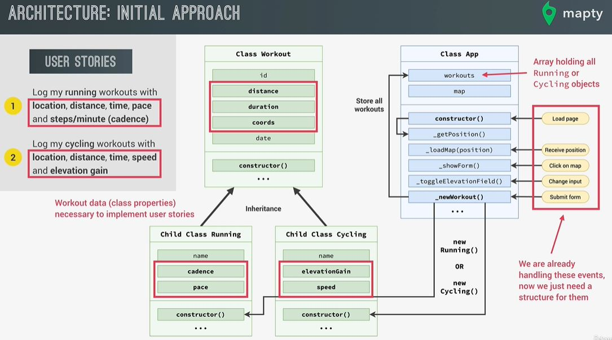

# The Complete JavaScript Course 2024: From Zero to Expert!

## Workout tracker App 🏃‍♀️🏃‍♂️: OOP, Geolocation, External Libraries, and More!

- GeoLocation API
- Displaying a Map using Leaflet library
- Displaying a Map Marker
- Rendering Workout Input Form
- Project Architecture
- Refactoring for Project Architecture
- Managing Workout Data: Creating Classes
- Creating a New Workout
- Rendering Workouts
- Working with Local Storage

## 📝 Flowchart

</img>  

## 🏗 App Architecture

